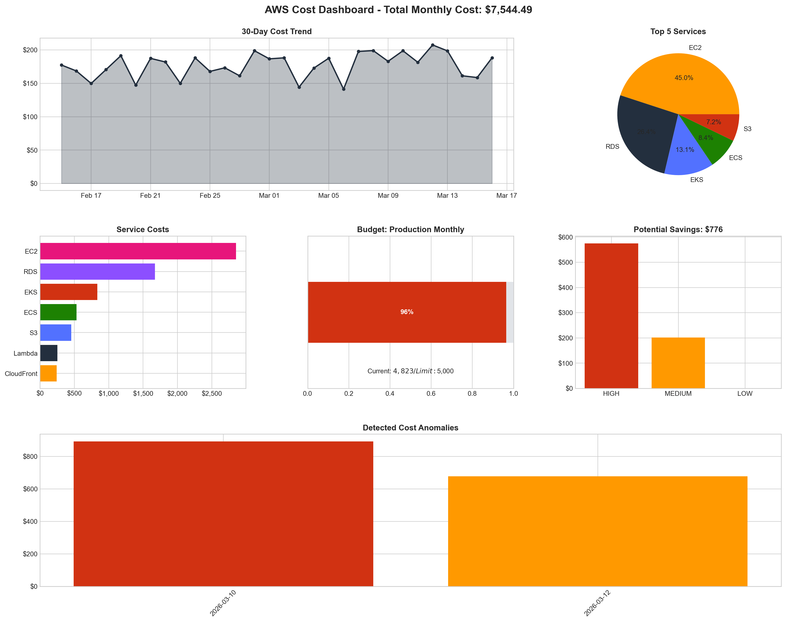

# AWS Cost Audit Tool

A comprehensive Python-based AWS cost analysis and optimization tool that helps identify waste, optimize spending, and generate detailed cost reports with actionable recommendations.



## Features

- **Cost Analysis**: Detailed breakdown of AWS costs by service with trend analysis
- **Waste Identification**: Automatic detection of idle resources, unattached storage, and underutilized instances
- **Optimization Recommendations**: Actionable suggestions for right-sizing, Reserved Instances, and Savings Plans
- **Anomaly Detection**: Statistical analysis to identify unusual spending patterns
- **Budget Alerts Simulation**: Monitor spending against configured budgets
- **Comprehensive Reports**: HTML, JSON, Markdown, and CSV report formats
- **Interactive Visualizations**: Professional charts and dashboards

## Methodology

### Data Sources
The tool leverages multiple AWS APIs to gather comprehensive cost and usage data:

| Source | Purpose |
|--------|---------|
| AWS Cost Explorer | Historical cost data, forecasts, and recommendations |
| AWS CloudWatch | Resource utilization metrics (CPU, memory, network) |
| AWS Budgets | Budget definitions and alerts |
| Amazon EC2 API | Instance inventory and state |
| Amazon RDS API | Database instance utilization |
| Amazon EBS API | Volume inventory and attachment status |

### Analysis Techniques

#### 1. Right-Sizing Analysis
Identifies over-provisioned resources by analyzing utilization metrics:
- **CPU Threshold**: Instances averaging <10% CPU over 14 days are flagged
- **Memory Analysis**: RDS instances with low buffer cache hit ratios
- **Network Analysis**: Low throughput on provisioned bandwidth

#### 2. Idle Resource Detection
Discovers resources that are provisioned but not actively used:
- **Stopped EC2 Instances**: Still incurring EBS storage costs
- **Unattached EBS Volumes**: Volumes not connected to any instance
- **Unused Elastic IPs**: IPs not associated with running resources
- **Idle RDS Instances**: Databases with no active connections

#### 3. Anomaly Detection
Uses statistical methods to identify unusual spending:
- **Baseline Calculation**: Rolling 60-day average with standard deviation
- **Threshold**: 2σ (standard deviations) for medium, 3σ for high severity
- **Detection Window**: Last 7 days compared against baseline

#### 4. Cost Forecasting
Predicts future spending based on current trends:
- **Method**: Linear extrapolation with AWS Cost Explorer forecasts
- **Confidence**: Uses AWS ML-based predictions when available

### Health Score Calculation

The overall health score (0-100) is calculated as:

```
Score = 100
  - (Potential Savings % × 2)     [Max: -30 points]
  - (Anomalies × 5)               [Max: -20 points]
  - (Excess Recommendations × 2)  [Max: -20 points]
```

| Score | Status | Description |
|-------|--------|-------------|
| 80-100 | GOOD | Well-optimized infrastructure |
| 60-79 | FAIR | Some optimization opportunities |
| 0-59 | NEEDS_ATTENTION | Significant waste detected |

## Installation

### Prerequisites
- Python 3.8+
- AWS account with appropriate permissions
- AWS credentials configured (for live analysis)

### Setup

```bash
# Clone or navigate to the project
cd aws-cost-audit

# Create virtual environment
python -m venv .venv
source .venv/bin/activate  # On Windows: .venv\Scripts\activate

# Install runtime dependencies
pip install -r requirements.txt

# Install development tooling (optional)
pip install -r requirements-dev.txt
```

### AWS Permissions

For live AWS analysis, ensure your IAM user/role has these permissions:

```json
{
  "Version": "2012-10-17",
  "Statement": [
    {
      "Effect": "Allow",
      "Action": [
        "ce:GetCostAndUsage",
        "ce:GetCostForecast",
        "ce:GetReservationPurchaseRecommendation",
        "ce:GetSavingsPlansPurchaseRecommendation",
        "budgets:DescribeBudgets",
        "ec2:DescribeInstances",
        "ec2:DescribeVolumes",
        "ec2:DescribeAddresses",
        "rds:DescribeDBInstances",
        "cloudwatch:GetMetricStatistics"
      ],
      "Resource": "*"
    }
  ]
}
```

## Usage

### Quick Start (Demo Mode)

Generate a sample report using mock data:

```bash
python generate_sample_report.py
```

### Full Audit

Run a complete cost audit:

```bash
# With mock data (demo)
python -m src.aws_audit --full --mock

# With AWS credentials
python -m src.aws_audit --full --profile production
```

### Quick Analysis

Console-only quick analysis:

```bash
python -m src.aws_audit --quick
```

### Budget Check

Check budget status only:

```bash
python -m src.aws_audit --budget
```

### Command Line Options

```
Options:
  --full, -f      Run full cost audit with reports
  --quick, -q     Run quick analysis (console only)
  --budget, -b    Check budget status only
  --mock, -m      Use mock data for demonstration
  --profile, -p   AWS profile name from ~/.aws/credentials
  --output, -o    Output directory for charts (default: ./output)
  --reports, -r   Output directory for reports (default: ./reports)
  --start-date    Analysis start date (YYYY-MM-DD)
  --end-date      Analysis end date (YYYY-MM-DD)
```

## Project Structure

```
aws-cost-audit/
├── .github/workflows/ci.yml    # GitHub Actions validation pipeline
├── docs/assets/                # Stable README assets
├── src/
│   ├── audit_workflow.py       # Shared audit orchestration helpers
│   ├── aws_audit.py            # Main CLI entry point
│   ├── cost_analyzer.py        # AWS cost analysis core module
│   ├── visualizer.py           # Chart generation module
│   └── report_generator.py     # Report generation module
├── config/
│   └── settings.example.yaml   # Example configuration
├── output/                     # Local generated charts (gitignored)
├── reports/                    # Local generated reports (gitignored)
├── sample_data/                # Sample data for testing
├── tests/                      # Automated tests
├── generate_sample_report.py   # Demo report generator
├── requirements.txt            # Runtime dependencies
├── requirements-dev.txt        # Dev dependencies and tooling
├── pyproject.toml              # Black and pytest configuration
└── README.md                   # This file
```

## Development

```bash
# Format code
python -m black .

# Run lint
python -m flake8 .

# Run tests
python -m pytest
```

## Output Examples

### Generated Reports

1. **HTML Report** - Interactive web report with styling
   - Executive summary cards
   - Service cost tables
   - Optimization recommendations
   - Budget status
   - Anomaly alerts

2. **JSON Report** - Structured data for automation
   - Machine-readable format
   - Easy integration with other tools
   - API-ready structure

3. **Markdown Report** - Documentation-friendly format
   - Git-compatible
   - Wiki-ready
   - Static site generators

4. **CSV Export** - Spreadsheet-compatible data
   - Excel importable
   - Data analysis ready

### Generated Visualizations

| Chart | Description |
|-------|-------------|
| `service_cost_breakdown.png` | Horizontal bar chart of top services |
| `cost_trend.png` | Daily cost with moving average |
| `cost_distribution.png` | Pie chart of cost distribution |
| `savings_opportunities.png` | Potential savings visualization |
| `budget_status.png` | Budget utilization progress |
| `anomaly_timeline.png` | Anomaly detection timeline |
| `cost_dashboard.png` | Comprehensive dashboard |

## Programmatic Usage

```python
from src.audit_workflow import collect_audit_results, generate_audit_artifacts
from src.cost_analyzer import get_analyzer
from src.visualizer import CostVisualizer
from src.report_generator import ReportGenerator

# Initialize analyzer (use mock for demo)
analyzer = get_analyzer(use_mock=True)

# Collect the full dataset
audit_results = collect_audit_results(
    analyzer=analyzer,
    start_date="2026-02-15",
    end_date="2026-03-15",
)

# Generate reports and visualizations
visualizer = CostVisualizer(output_dir="./output")
report_gen = ReportGenerator(output_dir="./reports")
artifacts = generate_audit_artifacts(audit_results, visualizer, report_gen)
print(artifacts.html_report)
```

## Sample Report Output

### Executive Summary

```
┌─────────────────────────────────────────────────────────────┐
│                    EXECUTIVE SUMMARY                         │
├─────────────────────────────────────────────────────────────┤
│ Total Spend (30 Days):          $8,456.78                   │
│ Forecasted Spend:               $9,234.56                   │
│ Potential Monthly Savings:      $892.40 (10.6%)             │
│ Optimization Opportunities:     7                           │
│ Anomalies Detected:             2                           │
│ Health Score:                   68/100 (FAIR)               │
└─────────────────────────────────────────────────────────────┘
```

### Top Optimization Recommendations

| Priority | Service | Resource | Savings | Effort |
|----------|---------|----------|---------|--------|
| HIGH | EC2 | i-web-server-01 | $146.00/mo | Moderate |
| HIGH | RDS | db-unused-test | $156.00/mo | Moderate |
| HIGH | EBS | vol-0xyz789 | $45.00/mo | Easy |
| MEDIUM | EC2 | i-api-server-02 | $70.00/mo | Moderate |

## Best Practices

1. **Regular Audits**: Run monthly to track optimization progress
2. **Set Realistic Budgets**: Use historical data to set limits
3. **Act on High Priority Items**: Focus on HIGH priority recommendations first
4. **Review Anomalies Promptly**: Investigate cost spikes within 24 hours
5. **Track Savings**: Document implemented optimizations and realized savings

## Limitations

- Cost Explorer data has a 24-48 hour delay
- Some services may not have detailed utilization metrics
- Anomaly detection requires 30+ days of baseline data
- Forecasting accuracy decreases with highly variable workloads

## Contributing

1. Fork the repository
2. Create a feature branch
3. Run `python -m black .`, `python -m flake8 .`, and `python -m pytest`
4. Add tests for new functionality
5. Submit a pull request

## License

MIT License - See LICENSE file for details.

## Acknowledgments

- AWS Cost Explorer API for comprehensive cost data
- Matplotlib for visualization capabilities
- AWS Well-Architected Framework for optimization best practices

---

*Built for cloud cost optimization and FinOps excellence*
